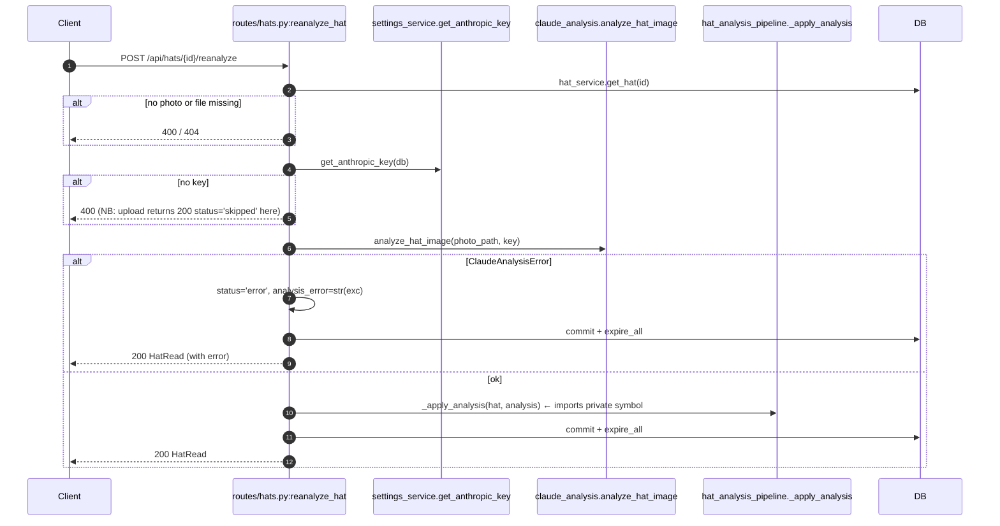
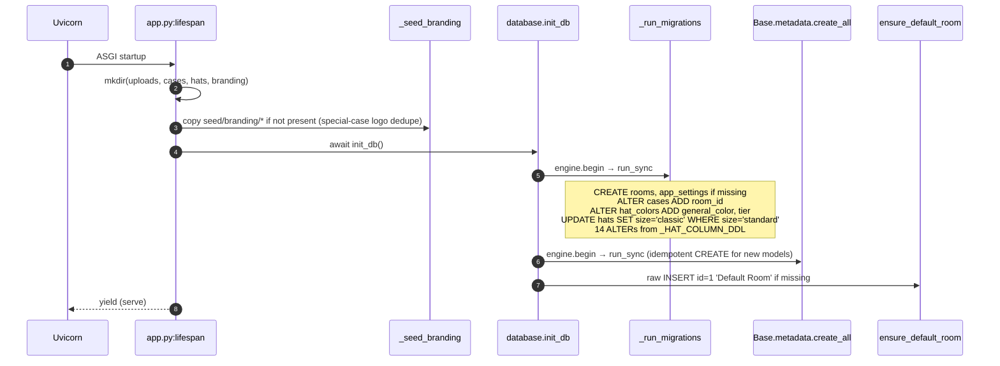
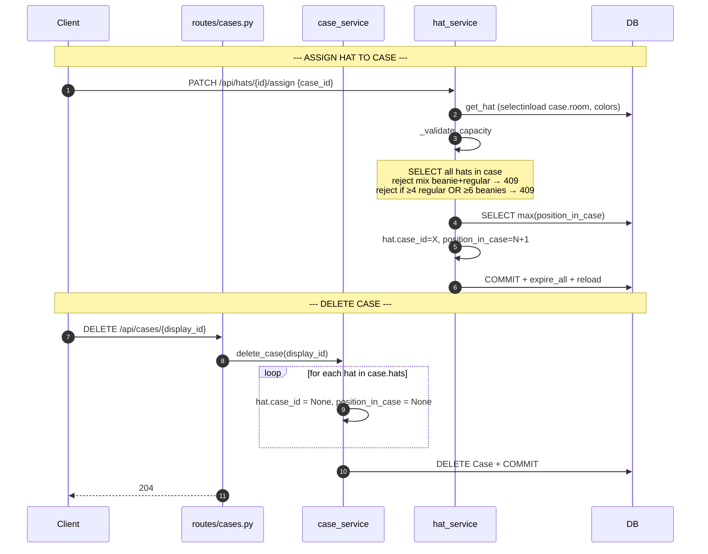

# Headroom — Design Document

> _The Outrun-grade vault for your hat collection._

## 1. Title & One-Line Summary

**Headroom** is a single-user, self-hosted hat-collection tracker that turns a phone photo into a structured catalog entry — brand, model, color palette, retail price — using Claude Vision and on-device background removal, and serves it over a synthwave React SPA from one Docker container on a Raspberry Pi.

---

## 2. Problem Statement

A hat collector has dozens to hundreds of hats spread across cases in different rooms. They want a digital index that survives a flood, a phone reset, and bad lighting; they want it on the home network, not in the cloud; and they don't want to manually type "Melin A-Game Hydro · navy + white · primary brim color #1c2541" for every cap.

Reverse-engineered from behavior, Headroom solves four concrete sub-problems:

1. **Where is the hat?** Rooms contain Cases; Cases contain Hats with a position. (`models/room.py`, `models/case.py`, `models/hat.py:36-65`)
2. **What is the hat?** A photo upload triggers Claude Vision tool-use that returns a strict JSON record: brand, model_name, model_confidence, style_descriptor, design_notes, estimated_new_price_usd, and 1–5 colors with hex + tier. (`services/claude_analysis.py:51-125`)
3. **What does the hat look like in the gallery?** Background removal converts every photo to a transparent PNG so it floats on the synthwave canvas. (`services/background_removal.py:33-46`, `frontend/src/styles/app.css`)
4. **What's it worth?** Retail price comes from Claude. Resale price stays null on principle — for Melin hats, the app builds a deep link into melinrecap.com instead of fabricating a number. (`services/melin_recap.py:1-9, 47-60`, `README.md:117-122`)

---

## 3. Goals & Non-Goals (Inferred)

> Inferred from code, README, CHANGELOG, and commit messages. Not from a spec the author wrote.

### Goals

- **Run unattended on a Raspberry Pi 4/5.** Multi-arch Docker image, lightweight 4.7MB U²-Net rembg model by default, tini as PID 1, uvicorn single-process. (`Dockerfile`, `README.md:140-159`)
- **Always save the photo.** Every degradation path — rembg failure, Claude failure, missing API key — still leaves the user with a saved photo and a row in `hats`. (`services/hat_analysis_pipeline.py:48-79`)
- **Don't lie to the user.** Resale prices are not invented; API keys are masked on read; `analysis_status='skipped'` is a first-class state distinct from `error`. (`services/melin_recap.py:48-60`, `services/settings_service.py:10-15`, `services/hat_analysis_pipeline.py:67-70`)
- **Look like 1986.** Hand-written synthwave CSS (1,278 LOC in `frontend/src/styles/app.css`), Audiowide/Orbitron/JetBrains-Mono typography, neon flicker keyframes, perspective grid only on `>= 992px`.
- **Mobile/iPad-first.** Bottom nav primary, top nav at `lg+`, 16px input font to suppress iOS zoom, native camera capture via `<input type="file" accept="image/*" capture>`.
- **Be honest about being AI-assisted.** v0.2.0 commits openly carry `Co-Authored-By: Claude Opus 4.7`. (`Rorschach §1, §7`)

### Non-Goals

- **Multi-user.** No User model, no auth, no per-user data. `AppSetting` is a global key/value table.
- **Public-internet exposure.** No CSRF, no rate limit, CORS allow-list defaults to `localhost:5173` (dev) / `localhost:8000` (compose).
- **High concurrency.** rembg runs under a process-wide `asyncio.Lock`; uploads serialise. Single-user assumption rules.
- **Background jobs.** The full upload pipeline (Pillow + rembg + Claude) runs synchronously inside the request — 5–30s per upload. The `analysis_status='pending'` value mentioned in `models/hat.py:43` is never written; it's a placeholder for a queue that doesn't exist.
- **Formal migrations.** No Alembic; schema evolves via hand-written ALTER TABLE in `database.py:_run_migrations()`.
- **Live resale scraping.** melinrecap.com is JS-rendered; the code intentionally builds a URL and does no fetch.

---

## 4. High-Level Design

### Architecture

```
┌────────────────────────────────────────────────────────────────────┐
│ Browser (mobile, iPad, desktop)                                    │
│  React 19 SPA + TanStack Query + hand-written synthwave CSS        │
│  ─ pages/ (12) own queryKey + invalidation                         │
│  ─ api/*.ts → apiFetch wrapper (api/client.ts)                     │
└──────────────────────────┬─────────────────────────────────────────┘
                           │ HTTP/JSON  (same-origin in prod)
┌──────────────────────────▼─────────────────────────────────────────┐
│ FastAPI process (uvicorn)  — one container, EXPOSE 8000           │
│  L0  app.py                lifespan + CORS + SPA fallback          │
│  L1  routes/*.py           33 endpoints, 7 routers                 │
│  L2  services/*_service.py case/hat/room/search/settings rules     │
│  L2′ services/             pipeline orchestrator                   │
│        hat_analysis_pipeline.py                                    │
│  L2′-IO services/          external adapters                       │
│        claude_analysis.py  ──▶ api.anthropic.com (HTTPS)           │
│        background_removal.py ──▶ ~/.u2net/u2netp.onnx (local)      │
│        melin_recap.py      ──▶ URL string only (no fetch)          │
│  L3  models/*.py           SQLAlchemy 2.x async, lazy='selectin'   │
│  L4  database.py + aiosqlite  ──▶ /data/headroom.db                │
│      utils/photo.py        Pillow + pillow_heif                    │
│                                                                    │
│  Static mounts: /uploads (StaticFiles), /assets (SPA bundle),     │
│                 /{full_path:path} → index.html (SPA fallback)     │
└────────────────────────────────────────────────────────────────────┘
                           │
                           ▼
                  /data volume on host
                    ├── headroom.db
                    └── uploads/
                          ├── cases/<uuid>.jpg
                          ├── hats/<uuid>.png      (transparent cutout)
                          └── branding/logo.{png|jpg|webp}
```

### Prose

Headroom is a **strict onion** (Stratum §1): HTTP routes parse and dispatch, services own business rules and most commits, models are SQLAlchemy `Mapped[T]` declarations, and `database.py` owns the engine + lifespan migrations. There are no circular imports (Roentgen §2a) and routes never import the Anthropic SDK directly.

Grafted onto the services layer is a **pipeline lobe** (`services/hat_analysis_pipeline.py`) whose job is to compose three external-IO adapters — `background_removal` (rembg/ONNX), `claude_analysis` (AsyncAnthropic), and `melin_recap` (URL builder) — into one mutate-the-Hat-in-place async function. The pipeline explicitly defers commit to its caller; the route owns the transaction boundary (Stratum §2 "Commit ownership").

The **frontend** is a vanilla TanStack Query SPA: pages own `useQuery`/`useMutation`, components are mostly presentational, the API layer is a 16-line `apiFetch<T>` generic. The query-key convention is documented in `CLAUDE.md` and is consistent across all 12 pages: `['rooms']` is full objects, `['meta','rooms']` is dropdown options, room mutations invalidate both. Bootstrap was dropped in v0.2.0 but ~100 lines of utility-class shims (lines 1176-1278 of `app.css`) preserve the JSX class names.

The **deployment unit is one Docker container** running a single uvicorn process. The frontend is built into `frontend/dist` at image-build time (Stage 1) and served by FastAPI in production. The rembg ONNX model is pre-downloaded at build time (Stage 2) and copied into `~/.u2net` for the runtime user. State lives in a single `/data` volume.

---

## 5. API & Interface Definitions

There are no CLI commands and no library exports. Headroom is a single deployable. The only public surface is HTTP.

### HTTP route inventory (33 endpoints, 7 routers)

| Method | Path | Purpose | Anchor |
|---|---|---|---|
| GET | `/health` | Liveness only — returns `{"status": "ok"}` unconditionally | `routes/health.py:6-8` |
| POST | `/api/cases` | Create case (auto-sequenced display_id) | `routes/cases.py` |
| GET | `/api/cases` | List cases (optional `?room_id=`) | `routes/cases.py` |
| GET | `/api/cases/{display_id}` | Case detail with hats | `routes/cases.py` |
| PUT | `/api/cases/{display_id}` | Update case (room, type) | `routes/cases.py` |
| DELETE | `/api/cases/{display_id}` | Delete case (orphans hats to `case_id=NULL`) | `routes/cases.py` |
| POST | `/api/cases/{display_id}/photo` | Upload case photo (Pillow only, no AI) | `routes/cases.py:96-128` |
| POST | `/api/hats` | Create hat | `routes/hats.py` |
| GET | `/api/hats` | List hats (filterable) | `routes/hats.py` |
| GET | `/api/hats/{hat_id}` | Hat detail | `routes/hats.py` |
| PUT | `/api/hats/{hat_id}` | Update hat (incl. AI-derived overrides) | `routes/hats.py` |
| DELETE | `/api/hats/{hat_id}` | Delete hat | `routes/hats.py` |
| PATCH | `/api/hats/{hat_id}/assign` | Move hat to a case (capacity-checked) | `routes/hats.py` |
| PUT | `/api/hats/{hat_id}/colors` | Replace color palette | `routes/hats.py:118-139` |
| POST | `/api/hats/{hat_id}/photo` | **Upload + analyze** (5-stage pipeline) | `routes/hats.py:142-174` |
| POST | `/api/hats/{hat_id}/reanalyze` | Re-run Claude on existing photo | `routes/hats.py:177-213` |
| POST | `/api/rooms` | Create room | `routes/rooms.py` |
| GET | `/api/rooms` | List rooms (full objects + case_count) | `routes/rooms.py` |
| GET | `/api/rooms/{room_id}` | Room detail | `routes/rooms.py` |
| PUT | `/api/rooms/{room_id}` | Update room | `routes/rooms.py` |
| DELETE | `/api/rooms/{room_id}` | Delete room (reassigns cases to id=1; refuses to delete id=1) | `routes/rooms.py`, `services/room_service.py:58-67` |
| GET | `/api/meta/styles` | Enum dropdown options | `routes/meta.py` |
| GET | `/api/meta/sizes` | Enum dropdown options | `routes/meta.py` |
| GET | `/api/meta/conditions` | Enum dropdown options | `routes/meta.py` |
| GET | `/api/meta/rooms` | Room dropdown `{value,label}[]` | `routes/meta.py` |
| GET | `/api/search` | Multi-term AND search across style/condition/size/colors/room | `routes/search.py:12-43` |
| GET | `/api/settings/logo` | Current logo path | `routes/settings.py:34-39` |
| POST | `/api/settings/logo` | Upload logo (Pillow resize, ≤96px) | `routes/settings.py:42-79` |
| DELETE | `/api/settings/logo` | Delete logo | `routes/settings.py:82-86` |
| GET | `/api/settings/api-key` | **Returns masked key + source** | `routes/settings.py:92-101` |
| PUT | `/api/settings/api-key` | **Set Anthropic API key** | `routes/settings.py:104-112` |
| DELETE | `/api/settings/api-key` | Clear DB-stored key | `routes/settings.py:115-117` |
| POST | `/api/settings/api-key/test` | **Live ping to Claude** | `routes/settings.py:120-126` |

Plus three static mounts on the same FastAPI app:
- `/uploads/*` → `StaticFiles(settings.upload_dir)` (only if dir exists)
- `/assets/*` → `StaticFiles(frontend/dist/assets)` (only if dist exists)
- `/{full_path:path}` → SPA fallback returning `index.html`

### AI-related request/response shapes

#### `POST /api/hats/{id}/photo` — Upload + analyze

**Request**: `multipart/form-data` with field `photo: UploadFile`. Content-type must match `validate_image_content_type` (jpg/jpeg/png/webp/gif/heic).

**Response**: `200 HatRead` (full hat record, including new `analysis_status`). Even on rembg or Claude failure, returns 200 with degraded fields.

**Error codes**:
- `400` — `Invalid image type` (content-type check, `routes/hats.py:149`)
- `404` — `Hat not found` (`routes/hats.py:147`)
- `500` — Pillow exception (no try/except wraps `process_image`)

**Side effects**:
1. Old `hat.photo_path` (if any) deleted from disk.
2. New JPEG written to `uploads/hats/{uuid}.jpg`.
3. rembg attempts to produce `uploads/hats/{uuid}.png`; on success, JPEG is unlinked.
4. `hat.photo_path` set to canonical path (PNG if rembg succeeded, JPEG otherwise).
5. Anthropic call may set `brand`, `model_name`, `model_confidence`, `style_descriptor`, `design_notes`, `estimated_new_price`, `estimated_new_price_source='Claude Vision'`, color rows, and Melin resale link.
6. `analysis_status` ∈ {`ok`, `error`, `skipped`}; `analysis_error` populated on non-ok.

#### `POST /api/hats/{id}/reanalyze` — Re-run Claude on existing photo

**Request**: empty body.

**Response**: `200 HatRead`.

**Error codes** (note inconsistency with upload — Doppler §2):
- `400` — `Hat has no photo to analyze` (`routes/hats.py:185`)
- `400` — `No Anthropic API key configured` (`routes/hats.py:198`) — *upload would have returned 200 with `status=skipped`*
- `404` — `Hat not found` (`routes/hats.py:182`)
- `404` — `Photo file missing on disk` (`routes/hats.py:189`)

#### `POST /api/settings/api-key/test` — Live ping

**Request**: empty body. Uses currently-resolved key (DB > env).

**Response**: `200 ApiKeyTestResult`:
```json
{ "ok": true,  "detail": "API key works." }
{ "ok": false, "detail": "No API key configured." }
{ "ok": false, "detail": "<error message from anthropic>" }
```

**Cost**: Burns one real `messages.create` call against `settings.anthropic_model` with `max_tokens=4` (`services/claude_analysis.py:245-262`). Cheap but non-zero — don't spam.

#### `PUT /api/settings/api-key` — Store key

**Request**:
```json
{ "api_key": "sk-ant-..." }
```
Validation: `min_length=8, max_length=200` (`schemas/settings.py:13`).

**Response**: `200 ApiKeyStatus`:
```json
{ "configured": true, "source": "database", "masked": "sk-an…abcd" }
```

`mask_key` returns first 5 + `…` + last 4 (`services/settings_service.py:10-15`). The raw key is **never returned** by any endpoint.

**No auth.** This is a documented red flag (Stratum §3 R1, Rorschach §3).

---

## 6. Edge Definitions

Every place this system touches another:

| Edge | Direction | Contract | Notes |
|---|---|---|---|
| **SQLite at `/data/headroom.db`** | bidirectional | aiosqlite driver, async SQLAlchemy 2.x, `expire_on_commit=False` | Schema lifecycle: `_run_migrations` (raw `text()` ALTER) → `Base.metadata.create_all` → `ensure_default_room` (raw INSERT). 5 tables: `rooms`, `cases`, `hats`, `hat_colors`, `app_settings`. Foreign keys are not enforced (no `PRAGMA foreign_keys=ON`); they're decorative on SQLite (Lumen §4). |
| **Filesystem `/data/uploads/cases/`** | write-on-upload, read-on-serve | One JPEG per case at `<uuid>.jpg`, served as `/uploads/cases/<uuid>.jpg` | `routes/cases.py:96-128`. Pillow resize to max 1200px, JPEG q=85. No cleanup on case delete (orphan files). |
| **Filesystem `/data/uploads/hats/`** | write-on-upload, read-on-serve | One PNG (or fallback JPEG) per hat | `services/hat_analysis_pipeline.py:48-62`. Old photo unlinked before new write (`routes/hats.py:165-167`). |
| **Filesystem `/data/uploads/branding/`** | write-on-upload, read-on-serve | One file matching `logo.{png,jpg,webp}` | Seeded from `seed/branding/logo.png` on first boot (`app.py:20-40`). Resized to ≤96px height (`routes/settings.py:69-72`). |
| **Filesystem `~/.u2net/<model>.onnx`** | read-only | rembg's lazy session loader checks here first; downloads if missing | Pre-cached at Docker build (`Dockerfile:50, 73`). On a fresh non-Docker install, first photo upload triggers a network download. |
| **Filesystem `seed/branding/`** | read-only | Source of default logo on first boot | `app.py:_seed_branding`. Idempotent: if any `logo.*` file already exists in target, skipped. |
| **`https://api.anthropic.com/v1/messages`** | outbound only | `AsyncAnthropic.messages.create(model=settings.anthropic_model, system=[...cache_control: ephemeral], tools=[HAT_ANALYSIS_TOOL], tool_choice={type: tool, name: record_hat_analysis})` with `timeout=settings.http_timeout` | One call per upload + reanalyze + key-test. New client per call (no pool reuse). System prompt cached via `cache_control: ephemeral`. Auth errors map to `ClaudeAnalysisError("Invalid Anthropic API key")` (`services/claude_analysis.py:209-211`). |
| **`https://www.melinrecap.com/?...`** | URL build only — **NO fetch** | Deep link string stored on `hat.resale_price_url` | `services/melin_recap.py:47-60`. Brand check is `"melin" in brand.lower()`. Style → category map at `melin_recap.py:19-29`. Deliberate non-scraping (README:117-122). |
| **Browser** | inbound HTTP/JSON | CORS allow-list from `settings.cors_origins`; SPA served same-origin in prod | Dev: vite proxy `:5173` → `:8000` for `/api` and `/uploads`. |
| **Docker host** | volume + port | `8000:8000`, named volume `headroom-data:/data` | `docker-compose.yml`. No healthcheck wired. |
| **stdout/stderr** | one-way | uvicorn access logs + 2 `logger.warning` calls | No `logging.basicConfig` configured anywhere; warnings escape via the Python `lastResort` handler (Auscultator R4). No log rotation in compose. |

---

## 7. Key Flows

### 7.1 Hat photo upload — the marquee flow

The five-stage pipeline. Every box is a "still 200 OK" path.

```mermaid
sequenceDiagram
    autonumber
    participant Client
    participant Route as routes/hats.py:upload_hat_photo
    participant Photo as utils/photo.process_image
    participant Pipe as hat_analysis_pipeline.finalize_hat_photo
    participant Bg as background_removal.remove_background
    participant Set as settings_service.get_anthropic_key
    participant Claude as claude_analysis.analyze_hat_image
    participant Melin as melin_recap.build_resale_pointer
    participant DB

    Client->>Route: POST multipart photo
    Route->>Route: validate_image_content_type
    Route->>DB: hat_service.get_hat(id)
    Route->>Route: tempfile + shutil.copyfileobj
    Route->>Photo: Pillow open → RGB → thumbnail(1200) → JPEG q=85
    Note over Photo: BLOCKS event loop (sync Pillow)
    Route->>Route: unlink temp + old hat photo
    Route->>Pipe: finalize_hat_photo(db, hat, jpeg_path)

    Pipe->>Bg: remove_background(jpeg, target)
    Note over Bg: asyncio.to_thread(_remove_sync) under module-global asyncio.Lock<br/>Lazy rembg session init (cold-start tax)
    alt rembg succeeds
        Bg-->>Pipe: PNG path; Pipe unlinks JPEG; canonical=PNG
    else rembg fails
        Bg-->>Pipe: None (logger.warning); canonical=JPEG (silent fallback)
    end
    Pipe->>Pipe: hat.photo_path = "hats/{name}"

    Pipe->>Set: get_anthropic_key(db)
    alt no key
        Pipe->>Pipe: status='skipped', error='No Anthropic API key configured.'
        Pipe-->>Route: hat (mutated)
    else key found
        Pipe->>Claude: analyze_hat_image(canonical_path, key)
        Note over Claude: read_bytes + b64encode (BLOCKS loop)<br/>messages.create(tools=[HAT_ANALYSIS_TOOL], tool_choice=forced)
        alt ClaudeAnalysisError
            Pipe->>Pipe: status='error', analysis_error=str(exc)
        else success
            Pipe->>Pipe: _apply_analysis (brand, model, colors.clear+repopulate, prices)
            Pipe->>Melin: build_resale_pointer(brand, style)
            opt brand contains 'melin'
                Melin-->>Pipe: {resale_price=None, source='Melin Recap', url=deeplink}
            end
            Pipe->>Pipe: status='ok'
        end
    end

    Route->>DB: commit + expire_all
    Route->>DB: hat_service.get_hat(id) (reload with selectinload)
    Route-->>Client: 200 HatRead JSON
```

**Degradation table** (Doppler §1):

| Stage | Failure | Outcome |
|---|---|---|
| Content-type | Invalid mime | 400, no DB write |
| Pillow | Exception | Bubbles to 500 (no try/except) |
| rembg | Any exception | Returns None; canonical = original JPEG; logged WARNING |
| Settings key | None | `analysis_status='skipped'`; photo still saved |
| Claude API | Auth/API/parse | `analysis_status='error'`; photo still saved |
| Melin | Brand not Melin | Silently skipped; null resale fields |

### 7.2 Reanalyze — `POST /api/hats/{id}/reanalyze`

Same trailing portion of the upload flow, minus tempfile, Pillow, and rembg. Reuses the canonical photo on disk.



**Anomaly**: The route does five function-local imports (`_apply_analysis`, `analyze_hat_image`, `ClaudeAnalysisError`, `settings_service`, `datetime`) inside the handler at `routes/hats.py:188-194` despite top-level imports of the same modules. The `_apply_analysis` import reaches across the service-layer encapsulation boundary (Stratum §3, Lumen §5, Rorschach §3).

### 7.3 Boot — `lifespan`

Side-effect order matters: directories first, then branding seed, then DB.



**Trap**: migrations run **before** `create_all`. New columns on existing models must be added to `_HAT_COLUMN_DDL`; new models work via `create_all` automatically (Doppler §6, Lumen §4).

### 7.4 Case lifecycle — capacity + cascading



Note: deleted-case hats become invisible from the case grid but remain in the DB as `case_id=NULL`. Whether the gallery surfaces them as "unassigned" or they leak is an open question (Doppler open-questions).

---

## 8. Data Model

```
┌──────────┐ 1     N ┌──────────┐ 1     N ┌──────────┐ 1     N ┌────────────┐
│  Room    │────────▶│  Case    │────────▶│   Hat    │────────▶│ HatColor   │
└──────────┘         └──────────┘         └──────────┘         └────────────┘
   id (PK)             id (PK)              id (PK)              id (PK)
   name                case_type            case_id (FK, null)    hat_id (FK)
   created_at          sequence_number      position_in_case      color_name
   updated_at          display_id           condition             general_color
                       photo_path           size                  hex_value
                       room_id (FK)         style                 dominance_rank
                       created_at           is_beanie             tier
                       updated_at           brand                 (no timestamps)
                                            model_name
                                            model_confidence
┌──────────────┐                            style_descriptor
│ AppSetting   │                            design_notes
└──────────────┘                            estimated_new_price[_source]
   key (PK)                                 resale_price[_source/_url/_checked_at]
   value                                    photo_path
   updated_at                               analysis_status / _error / analyzed_at
                                            created_at / updated_at
```

### Entities

- **Room** — display name + timestamps. Has many cases. `id=1` is the **Default Room**, seeded on every boot via raw INSERT (`database.py:ensure_default_room`).
- **Case** — `display_id` like `A-001` (archive) or `D-001` (daily_wear), auto-sequenced per `case_type`. Has many hats. Belongs to one room (default 1).
- **Hat** — has many `HatColor` rows; belongs to at most one Case. `is_beanie` is a boolean derived from `style == 'beanie'` (`models/hat.py`). All AI-derived fields live here (brand, model_name, prices, analysis_status).
- **HatColor** — 1–5 per hat. `tier ∈ {primary, secondary, tertiary, accent}`, `dominance_rank` orders by visual prominence, `color_name` is the CSS3 exact name and `general_color` is a human-friendly bucket.
- **AppSetting** — global key/value store. Currently only the Anthropic API key (`anthropic_api_key`).

### Key invariants

| Invariant | Enforced where | Anchor |
|---|---|---|
| **Cases are type-exclusive: 4 regular hats OR 6 beanies, never mixed** | Application-level (no DB constraint) | `services/hat_service.py:36-71` (`_validate_capacity`); constants `MAX_REGULAR=4`, `MAX_BEANIE=6` |
| **Default Room (id=1) cannot be deleted** | `room_service` | `services/room_service.py:58-61` raises 409 |
| **Deleting a case orphans its hats to `case_id=NULL`, `position_in_case=NULL`** | `case_service` (no FK CASCADE) | `services/case_service.py` (delete_case) |
| **Deleting a room reassigns its cases to Default Room (id=1)** | `room_service` | `services/room_service.py:64-67` uses bulk `update(Case)...where(...)` to avoid cascade |
| **Default Room exists at all times** | Boot-time | `database.py:ensure_default_room` runs every boot |
| **`hat_size='standard'` is migrated to `'classic'` on every boot** | One-shot UPDATE in `_run_migrations` | `database.py` |
| **Foreign keys are decorative** | SQLite without `PRAGMA foreign_keys=ON` | Lumen §4 |

### `analysis_status` state machine

```
[NULL] ──upload+no key──▶ skipped
       ──upload+claude err──▶ error
       ──upload+claude ok───▶ ok

skipped ──reanalyze ok───▶ ok
        ──reanalyze err──▶ error

error   ──reanalyze ok───▶ ok
        ──reanalyze err──▶ error  (overwrites analysis_error, keeps stale brand/model/colors)

ok      ──reanalyze ok───▶ ok    (overwrites everything)
        ──reanalyze err──▶ error  (keeps stale brand/model/colors)
```

The `pending` value documented in `models/hat.py:43` is **never written** anywhere. It's a placeholder for a not-yet-built background queue (Doppler §State Transitions).

---

## 9. Configuration & Deployment

### Environment variables (all `HEADROOM_`-prefixed)

| Variable | Default | Description | Anchor |
|---|---|---|---|
| `HEADROOM_DATABASE_URL` | `sqlite+aiosqlite:///./headroom.db` | DB connection string. **Relative path — only works when CWD is project root** (Stratum red-flag). Docker overrides to `sqlite+aiosqlite:////data/headroom.db` | `config.py:7`, `Dockerfile:60` |
| `HEADROOM_UPLOAD_DIR` | `uploads` | Where photos live. Docker overrides to `/data/uploads` | `config.py:8`, `Dockerfile:59` |
| `HEADROOM_CORS_ORIGINS` | `["http://localhost:5173"]` | JSON list. Compose sets `["http://localhost:8000"]` | `config.py:9`, `docker-compose.yml:17` |
| `HEADROOM_ANTHROPIC_API_KEY` | unset | **Fallback** API key. UI-stored DB key takes precedence | `config.py:12`, `services/settings_service.py:38-52` |
| `HEADROOM_ANTHROPIC_MODEL` | `claude-sonnet-4-6` | Vision model. **Likely DOA** — see Lumen open-questions | `config.py:15` |
| `HEADROOM_HTTP_TIMEOUT` | `30.0` | Per-request timeout for outbound HTTP | `config.py:18` |
| `HEADROOM_REMBG_MODEL` | `u2netp` | rembg model name. Read directly via `os.environ`, **bypasses pydantic-settings** | `services/background_removal.py:19` (Auscultator finding) |

### Secrets

- **Anthropic API key**. Two storage locations (DB > env). DB-stored key is masked (`prefix5…suffix4`) on every read; the raw value is never returned. **There is no auth on the endpoints that read/write/delete it** (Stratum red-flag).
- No other secrets. No DB password (SQLite). No JWT signing key (no auth).

### Dependencies

**Python (runtime)** — `fastapi`, `uvicorn[standard]`, `sqlalchemy[asyncio]`, `aiosqlite`, `pydantic-settings`, `python-multipart`, `Pillow`, `pillow-heif`, `anthropic>=0.40.0`, `httpx`, `beautifulsoup4` (declared but unused), `rembg[cpu]>=2.0.50`, `onnxruntime`. Total 75 packages locked (1,690-line `uv.lock`). Heavy transitives: `numpy`, `numba`, `scipy`, `scikit-image`, `pymatting`, `pooch`, `flatbuffers`, `protobuf`.

**JS (runtime)** — `react@^19.1.0`, `react-dom@^19.1.0`, `react-router-dom@^7.6.1`, `@tanstack/react-query@^5.80.7`. **No Bootstrap package** despite Bootstrap class names in JSX — replaced by ~100-line utility shim in `app.css` (Rorschach §1).

### Docker / Pi

- **Multi-stage Dockerfile** (`Dockerfile:1-89`):
  1. `node:22-bookworm-slim` — `npm ci` + `tsc --noEmit` + `vite build`.
  2. `python:3.12-slim-bookworm` — `uv sync` + apt `libgl1 libglib2.0-0 libheif1` + **pre-cache rembg model** via `python -c "from rembg import new_session; new_session('u2netp')"`.
  3. `python:3.12-slim-bookworm` runtime — copies venv + `~/.u2net` + `src` + `frontend/dist` + `seed`. Adds `tini`. Creates non-root user `headroom` (uid 1000). `WORKDIR /app`. `EXPOSE 8000`. `CMD ["uvicorn", "headroom.app:app", "--host", "0.0.0.0", "--port", "8000"]`. `ENTRYPOINT ["/usr/bin/tini", "--"]`.
- **Multi-arch**: amd64 + arm64 (for Pi 4/5).
- **Compose** (`docker-compose.yml`): one service, named volume `headroom-data:/data`, `restart: unless-stopped`, port `8000:8000`. **No healthcheck, no logging driver options, no resource limits** (Auscultator).

### Where data lives

| Path | What | Persists? |
|---|---|---|
| `/data/headroom.db` | SQLite — all rows | Yes (named volume `headroom-data`) |
| `/data/uploads/cases/<uuid>.jpg` | Case photos | Yes |
| `/data/uploads/hats/<uuid>.png` (or `.jpg`) | Hat photos (transparent cutouts) | Yes |
| `/data/uploads/branding/logo.{png,jpg,webp}` | Custom logo | Yes; survives restart; replaces seed default |
| `/home/headroom/.u2net/u2netp.onnx` | rembg model | Inside image (Stage 3 copy from Stage 2 cache) |

### Backup story

Back up the `/data` volume. There is no in-app backup endpoint, no scheduled snapshot, no external storage integration. README:158-159 says: "Photos and the SQLite DB live in the named `headroom-data` volume — back it up periodically."

---

## 10. Operational Notes

### Observability state (per Auscultator)

- **Logging**: 2 call sites in the entire backend (`background_removal.py:58`, `hat_analysis_pipeline.py:75`), both `logger.warning`. `claude_analysis.py:22` declares a logger but never uses it. **`logging.basicConfig()` is never called** — log lines escape only via the Python `lastResort` handler at WARNING+ (Auscultator R4).
- **Metrics**: zero. No counters, gauges, histograms. No `/metrics`, no Prometheus, no statsd, no OTel.
- **Tracing**: zero. No request_id middleware. No spans.
- **Health checks**: `/health` returns hard-coded `{"status": "ok"}` — does not check DB, disk, rembg, or API key (Auscultator R3). No `HEALTHCHECK` in Dockerfile, no `healthcheck:` in compose.
- **Alerting**: none.
- **Log retention**: docker-compose has no `logging:` block; relies on Docker daemon defaults (potentially unbounded JSON-file logs filling the SD card on a Pi).

The single visible failure-surface for users is the Hat Detail page's red "Analysis error" banner showing the raw exception string (`HatDetailPage.tsx:283-287`). Background-removal failure is **invisible** to the user.

### Scaling characteristics

- **Single-process uvicorn**. No `--workers` flag. The whole app is one event loop.
- **Single rembg session** behind a process-wide `asyncio.Lock`. Concurrent uploads serialise on rembg even though `to_thread` is used (Lumen §3, Doppler R1).
- **SQLite single-writer** semantics. Reads scale; writes don't.
- **One AsyncSession per request, held for the entire pipeline** (~5–30s for an upload). Fine on aiosqlite; would be a connection-pool problem on Postgres.
- **rembg cold-start tax**: first request post-boot triggers ONNX model load under the lock; that request is slow and all concurrent requests queue.

### Known performance properties

- **Pillow `process_image` runs synchronously on the event loop** (Doppler R2) — every photo upload blocks all other requests during decode + thumbnail.
- **Base64 encoding for Claude runs inline on the loop** (`claude_analysis.py:151-161`) — short but blocking.
- **`shutil.copyfileobj` from `UploadFile` to tempfile, and `shutil.copy2` in `_seed_branding`, are sync calls in async handlers** — fine in practice, pattern-inconsistent with the rembg `to_thread` discipline.
- **rembg session is global mutable state**; cold-start has a one-time multi-second cost that is invisible from the outside.
- **Search builds N correlated subqueries** (one per term) via `Hat.id.in_(select(...))` (Doppler R6). On SQLite without indexes on `color_name`/`general_color`, multi-term searches degrade quickly.
- **Anthropic SDK builds a new client per call** (`claude_analysis.py:178`) — pays TCP/TLS handshake every analysis (Lumen §1).
- **Prompt cache hit** lives only on the system prompt (`cache_control: ephemeral`); tools could be cached too but aren't (Lumen §1).

### Deployment posture

- **Designed for one user on a private network on a Raspberry Pi.** Many of the "missing" pieces (auth, rate limiting, observability, scaling) are deliberate omissions consistent with that brief (Stratum §4 closing note, Rorschach §5 tacit assumptions).
- **Anything beyond that brief becomes a real problem.** Public-internet exposure leaks the API key endpoint immediately.

---

## 11. Known Gaps & Open Questions

Union of open questions across all Phase 1 specialists.

### Architecture / encapsulation

- Should `update_hat_colors` be moved into `hat_service` to remove the route-layer ORM access at `routes/hats.py:124-138`? (Stratum)
- Should `reanalyze_hat` route delegate fully to a `hat_analysis_pipeline.reanalyze(hat)` function rather than re-implementing orchestration inline with a private helper? (Stratum, Lumen, Rorschach)
- Are the function-local imports in `reanalyze_hat` (`routes/hats.py:188-194`) intentional lazy-loads or accidental duplicates of top-level imports? (Roentgen)

### Anthropic integration

- **Is `claude-sonnet-4-6` (config.py:15) a real Anthropic model id?** Anthropic's published scheme is dated (`claude-sonnet-4-5-20250929`) or aliased (`claude-sonnet-4-5`). If wrong, every analysis 404s into `analysis_status='error'` (Lumen, Doppler).
- `claude_analysis.py:18` imports `AuthenticationError` from the SDK's private `anthropic._exceptions` module — fragile across SDK upgrades (Lumen, Rorschach).
- No retry on Anthropic transient errors; first 503 becomes a persisted error state (Stratum, Lumen).

### Concurrency

- Is the `asyncio.Lock` around `to_thread` in `background_removal.py` necessary? It serialises rembg globally and defeats the offload (Doppler, Lumen).
- Why does `process_image` (Pillow) NOT use `to_thread` when `remove_background` does? Both are CPU-bound (Doppler).

### Operations

- Does the operator actually `docker logs -f headroom`? If not, the WARNING-only-to-stdout pattern is effectively /dev/null (Auscultator).
- Is there an external uptime check (UptimeRobot, etc.)? If not, container restart loops go undetected (Auscultator).
- Does the Pi's Docker daemon have json-file log rotation configured at the daemon level? Compose doesn't set one (Auscultator).
- Is alerting even desired for a single-user app? (Auscultator)

### Auth / security

- Is the lack of any auth intentional for single-user-on-Pi? If exposed publicly, `/api/settings/api-key` lets anyone read/write/delete the Anthropic key (Stratum).

### Data semantics

- `delete_case` orphans hats to `case_id=NULL`. Is this intentional ("drawer of unassigned hats") or a leak that the gallery should surface? (Doppler)
- `analyzed_at` is set in three states (`ok`/`error`/`skipped`); semantics differ but a DB reader can't distinguish without joining `analysis_status` (Lumen cross-region §3).
- Is the duplicate `if img.mode in ('RGBA','P')` / `elif img.mode != 'RGB'` branching in `utils/photo.py:25-28` a relic or a never-noticed dead branch? Both branches do the same thing (Rorschach).

### Repo hygiene

- `frontend/headroom.db` exists at the frontend root — stray leftover or referenced by tooling? (Roentgen)
- `beautifulsoup4` is declared in `pyproject.toml` but never imported anywhere in `src/` (Roentgen).
- Was the synthwave CSS hand-tuned by Brandon or generated by Claude? Stylistically coherent, but volume + perfect token discipline is also LLM-shaped (Rorschach).
- Did Brandon ever read the v0.2.0 diff carefully? The function-local imports and `_apply_analysis` import are exactly the kind of defensive AI-coding tells a reviewer would have caught (Rorschach).

---

## Appendix: File index for new engineers

| Want to change… | Edit… |
|---|---|
| HTTP routes / API surface | `src/headroom/routes/{cases,hats,rooms,search,meta,settings,health}.py` |
| Business rules (capacity, sequencing, default-room protection) | `src/headroom/services/{case,hat,room,search,settings}_service.py` |
| AI pipeline orchestration | `src/headroom/services/hat_analysis_pipeline.py` |
| Anthropic prompt / tool schema | `src/headroom/services/claude_analysis.py` (`SYSTEM_PROMPT`, `HAT_ANALYSIS_TOOL`) |
| Background removal model | `HEADROOM_REMBG_MODEL` env var or `src/headroom/services/background_removal.py:19` |
| DB schema | `src/headroom/models/*.py` AND a matching ALTER in `src/headroom/database.py:_run_migrations` (`_HAT_COLUMN_DDL` for `hats` columns) |
| Pydantic I/O contracts | `src/headroom/schemas/*.py` |
| Synthwave styling | `frontend/src/styles/{tokens.css, app.css}` |
| Pages | `frontend/src/pages/*.tsx` (12 pages) |
| API client | `frontend/src/api/*.ts` + the typed `apiFetch<T>` in `client.ts` |
| TypeScript DTOs (mirror of Pydantic) | `frontend/src/types/index.ts` |
| Boot side effects | `src/headroom/app.py:lifespan` (runs in this order: mkdir → `_seed_branding` → `init_db`) |
| Docker / multi-arch / non-root | `Dockerfile`, `docker-compose.yml` |

End of design doc.
