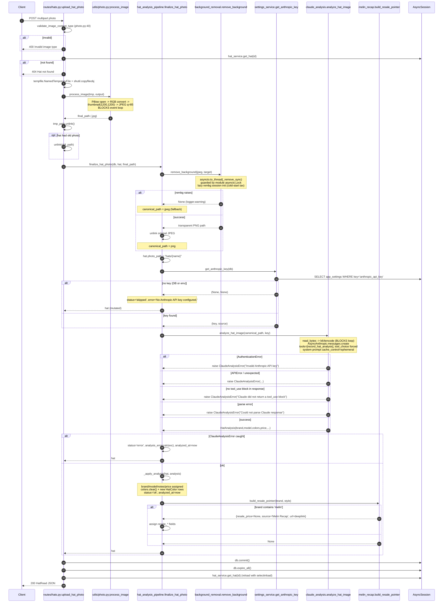
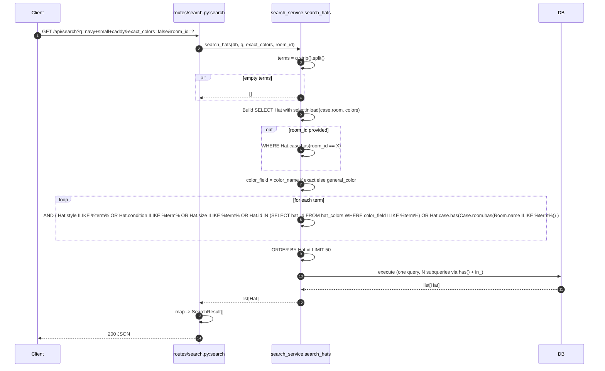
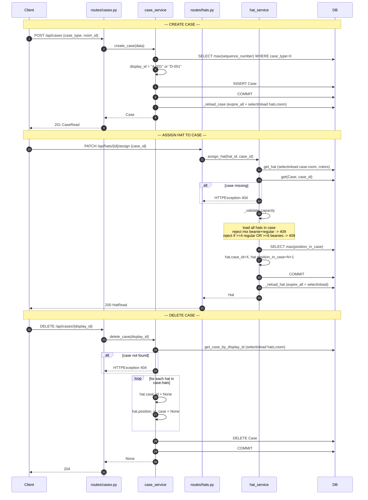
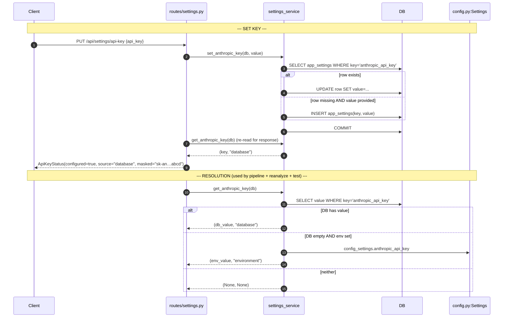
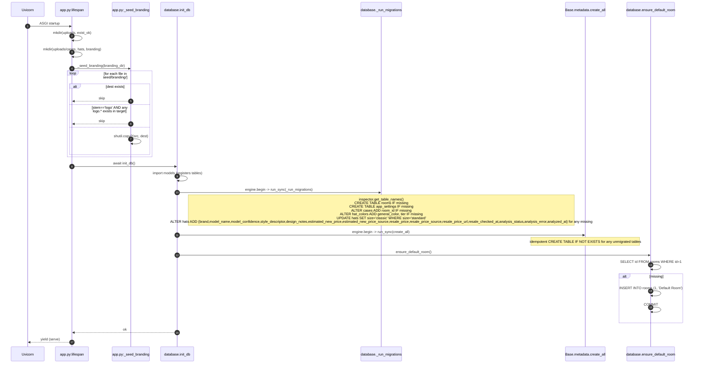
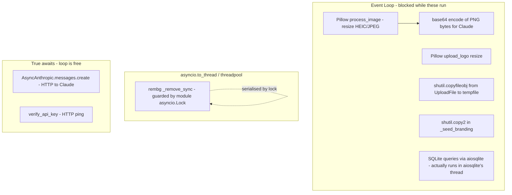
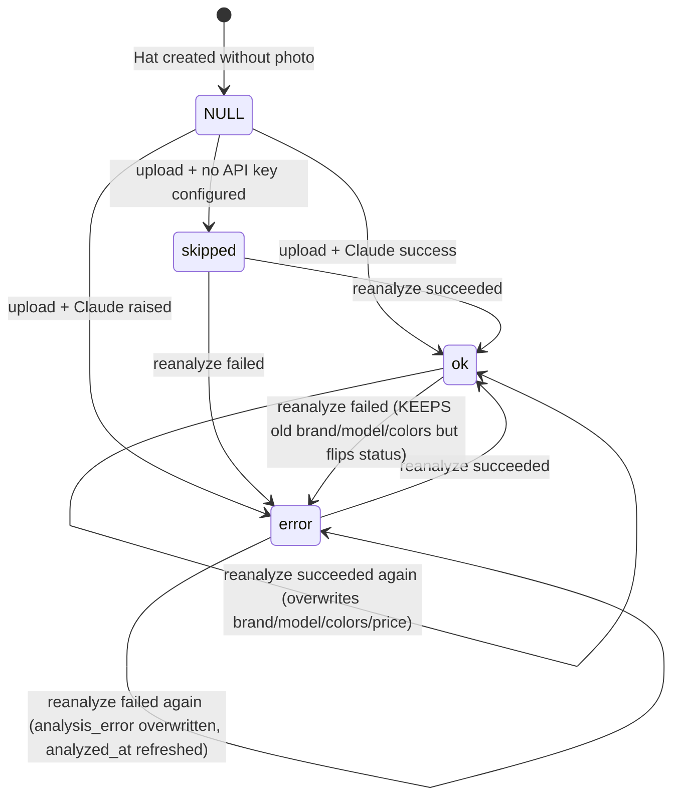
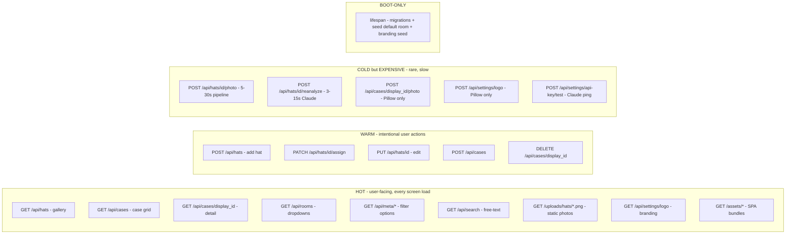

# Doppler — Runtime Flow Analysis

Target: `/Users/brandon/Things/Headroom` @ commit `a2efd86`. Stack: FastAPI + SQLAlchemy async + aiosqlite + Anthropic SDK + rembg + Pillow.

## 1. Hat Photo Upload — `POST /api/hats/{id}/photo`

**Anchor**: `src/headroom/routes/hats.py:142-174` -> `src/headroom/services/hat_analysis_pipeline.py:38-82` -> `src/headroom/services/background_removal.py:49-59` -> `src/headroom/services/claude_analysis.py:164-242` -> `src/headroom/services/melin_recap.py:47-60`.

**Degradation summary** (every box is a "still 200 OK" path):
| Stage | Failure mode | Outcome |
|---|---|---|
| Content-type | Invalid mime | 400, no DB write |
| Pillow process_image | Exception | Bubbles to 500 (no try/except) |
| rembg remove_background | Any exception | Returns None; canonical = original JPEG; logged |
| Settings key lookup | None returned | `analysis_status='skipped'`; photo still saved |
| Claude API | AuthError / APIError / parse | `analysis_status='error'`; photo still saved |
| Melin pointer | Brand not Melin | Silently skipped; null resale fields |

## 2. Reanalyze — `POST /api/hats/{id}/reanalyze`

**Anchor**: `src/headroom/routes/hats.py:177-213`.

```mermaid
sequenceDiagram
    autonumber
    participant Client
    participant Route as routes/hats.py:reanalyze_hat
    participant Set as settings_service.get_anthropic_key
    participant Claude as claude_analysis.analyze_hat_image
    participant Apply as hat_analysis_pipeline._apply_analysis
    participant DB

    Client->>Route: POST /api/hats/{id}/reanalyze
    Route->>DB: hat_service.get_hat(id)
    alt no hat.photo_path
        Route-->>Client: 400 Hat has no photo to analyze
    end
    Route->>Route: photo_path = upload_dir / hat.photo_path
    alt file missing on disk
        Route-->>Client: 404 Photo file missing on disk
    end
    Route->>Set: get_anthropic_key(db)
    alt no key
        Route-->>Client: 400 No Anthropic API key configured
    end
    Route->>Claude: analyze_hat_image(photo_path, key)
    alt ClaudeAnalysisError
        Route->>Route: status='error', analysis_error=str(exc), analyzed_at=now
        Route->>DB: commit + expire_all
        Route-->>Client: 200 HatRead (with error fields populated)
    else ok
        Route->>Apply: _apply_analysis(hat, analysis)
        Note over Apply: same brand/model/colors/price/Melin assignment<br/>as upload pipeline
        Route->>DB: commit + expire_all
        Route-->>Client: 200 HatRead
    end
```

**Difference vs upload**: no `process_image`, no `remove_background`, no temp-file. Reuses canonical photo as-is. Missing-key returns 400 (upload returns 200 with status=skipped) — inconsistent error model.

## 3. Hat Search — `GET /api/search`

**Anchor**: `src/headroom/routes/search.py:12-43` -> `src/headroom/services/search_service.py:11-57`.

Each term adds an OR-disjunction wrapped in an AND — semantically multi-term AND with per-term cross-field OR. Uses ILIKE (case-insensitive on Postgres; on SQLite this is just LIKE with case-folding for ASCII).

## 4. Case Lifecycle — Create / Assign Hat / Delete

**Anchor**: `src/headroom/routes/cases.py:65-93`, `src/headroom/services/case_service.py:34-91`, `src/headroom/services/hat_service.py:163-179` (assign), `src/headroom/services/hat_service.py:36-71` (capacity).

**Note**: Deleting a case orphans its hats (they remain in DB with `case_id=NULL`). Frontend gallery should surface these as "unassigned" or they become invisible.

## 5. Settings — API Key Set + Resolution

**Anchor**: `src/headroom/routes/settings.py:104-112`, `src/headroom/services/settings_service.py:38-52`.

**Precedence**: DB > env. UI-stored key always wins. `mask_key` shows first 5 / last 4 with ellipsis.

## 6. App Boot — `lifespan`

**Anchor**: `src/headroom/app.py:43-52` -> `src/headroom/database.py:104-115`.

**Note**: migrations run BEFORE `create_all`. This matters: if a developer adds a new table, `_run_migrations` will not see it (the inspector reports it as missing → ALTER paths skip; the new table is created cleanly by `create_all` after). If a developer ALTERs an existing table, the explicit migration must be added to `_HAT_COLUMN_DDL` or analogous block — `create_all` will NOT add columns to existing tables. This is documented in `CLAUDE.md`.

---

## Data Flow Map — Photo Bytes → Disk + DB

```mermaid
flowchart LR
    A[Client multipart upload] --> B{validate mime}
    B -->|reject| Z[400]
    B -->|ok| C[shutil.copyfileobj -> NamedTemporaryFile]
    C --> D[Pillow Image.open]
    D --> E{HEIC?}
    E -->|yes| E2[pillow_heif.register_heif_opener]
    E -->|no| F[convert RGB]
    E2 --> F
    F --> G[thumbnail max 1200px LANCZOS]
    G --> H[save JPEG q=85 -> uploads/hats/UUID.jpg]
    H --> I[unlink temp]
    I --> J[rembg new_session u2netp lazy-init]
    J --> K{remove succeeded?}
    K -->|no| L[fallback: keep JPEG as canonical]
    K -->|yes| M[save PNG with alpha -> uploads/hats/UUID.png]
    M --> N[unlink JPEG]
    L --> O[hat.photo_path = hats/UUID.jpg]
    N --> P[hat.photo_path = hats/UUID.png]
    O --> Q[Claude analysis branch]
    P --> Q
    Q --> R{API key?}
    R -->|no| S[status='skipped']
    R -->|yes| T[read_bytes + b64encode in-loop]
    T --> U[AsyncAnthropic.messages.create with image+tool]
    U --> V{tool_use block returned?}
    V -->|no| W[status='error']
    V -->|yes| X[parse HatAnalysis]
    X --> Y[_apply_analysis: brand,model,confidence,style_descriptor,design_notes,estimated_new_price]
    Y --> AA[hat.colors.clear + insert N HatColor rows]
    AA --> AB[build_resale_pointer]
    AB --> AC{is melin?}
    AC -->|no| AD[skip]
    AC -->|yes| AE[resale_price_url = melinrecap deeplink, resale_price=None, source='Melin Recap']
    AD --> AF[db.commit + expire_all]
    AE --> AF
    S --> AF
    W --> AF
    AF --> AG[reload hat with selectinload -> HatRead JSON]
```

**What lands where**:
- Disk: `uploads/hats/{uuid}.png` (or `.jpg` on rembg failure)
- `hats` row: `photo_path`, `brand`, `model_name`, `model_confidence`, `style_descriptor`, `design_notes`, `estimated_new_price`, `estimated_new_price_source='Claude Vision'`, `resale_*` fields (only for Melin), `analysis_status`, `analysis_error`, `analyzed_at`
- `hat_colors` rows: 1–5 per hat, with `dominance_rank`, `tier`, `color_name`, `general_color`, `hex_value`

---

## Async Map — Concurrency Reality

**Reality check**:
- Only ONE thing in the entire codebase uses `asyncio.to_thread`: `background_removal.remove_background` (`background_removal.py:56`).
- That `to_thread` call is wrapped in `_session_lock` (`background_removal.py:21, 55`) — so even though it runs off-loop, only one rembg call is in flight at a time across the whole process.
- `process_image` (Pillow) is CPU-bound and runs INLINE on the event loop — it blocks all other requests during resize/decode.
- `_read_image_b64` (`claude_analysis.py:151-161`) reads the file and base64-encodes it inline — for a 1MB image, this is short but synchronous on the loop.
- aiosqlite (`sqlite+aiosqlite://`) does run queries in a background thread per-connection, so DB IO doesn't block the loop, but everything else above does.
- Multiple uploads in parallel → serialised on rembg, contention on Pillow. Throughput is ~one upload at a time end-to-end.

---

## State Transitions — `hat.analysis_status`

**Anchors**:
- skipped: `hat_analysis_pipeline.py:67-70`
- error (upload): `hat_analysis_pipeline.py:74-79`
- ok: `hat_analysis_pipeline.py:93` via `_apply_analysis`
- error (reanalyze): `routes/hats.py:202-208`

**Note on the model docstring**: `hat.py:43` mentions a `pending` value in its inline comment, but no code path ever writes `pending`. Either dead documentation or a planned async-job state that hasn't been implemented (since the pipeline runs inline with the request, "pending" never makes sense in the current synchronous flow).

**Note on `error -> error`**: when reanalyze fails, it overwrites `analysis_error` and `analyzed_at` but does NOT clear `brand`/`model`/`colors`/`price` from a prior successful run — so the UI may show stale-but-good data plus an error badge. This is probably intentional (don't lose good data on a transient failure) but worth flagging.

---

## Hot vs. Cold Paths

**Observations**:
- The HOT paths are pure read-side SQLAlchemy + selectinload + Pydantic serialization. Cheap. The bottleneck under load will be SQLite write contention (single-writer) — not relevant for this small tool.
- Static asset serving (`/uploads/`, `/assets/`) goes through Starlette `StaticFiles` — fine for personal use, would want a CDN/nginx in front for many users.
- The COLD paths are where the runtime risk lives. A single hat photo upload can monopolize the rembg thread for ~10s on a Raspberry Pi (the explicit deployment target per `background_removal.py:5`). During that time other uploads queue, and Pillow on the loop blocks all other requests.
- `/api/settings/api-key/test` does a real Claude API ping with `max_tokens=4` — cheap but rate-limit-counted. Don't spam it.

---

## Cross-Cutting Notes

1. **Single AsyncSession per request, held for whole pipeline**: `routes/hats.py:142-174` opens a session via `Depends(get_db)` and keeps it for ~5–30 seconds while Pillow + rembg + Claude all run. SQLite handles this fine (the session isn't actively executing queries during the network calls), but if this ever moves to Postgres, that's a long-held connection.

2. **No background job queue**: everything runs synchronously inside the request. The `analysis_status='pending'` mentioned in the model is suggestive of a planned migration to a background worker (Celery / arq / dramatiq) where the upload returns immediately and analysis fills in later. Right now the client waits the full pipeline duration.

3. **Idempotency**: rebuilding `frontend/dist` and restarting the container will re-seed branding only for files not already present (`app.py:30-40`). Custom logos survive restarts. The default room is similarly idempotent (`database.py:93-101`).

4. **Error surface inconsistency between upload and reanalyze**: upload returns 200 with `analysis_status='skipped'` when no API key; reanalyze returns 400. This makes client error-handling forky.

5. **Anthropic model id**: `config.py:15` declares `claude-sonnet-4-6` — verify this is a real published model id. If it's a typo for `claude-sonnet-4-5` (or `claude-sonnet-4-5-20250929`-style), every upload's Claude call will 404 and degrade to `analysis_status='error'`.

End of report.
