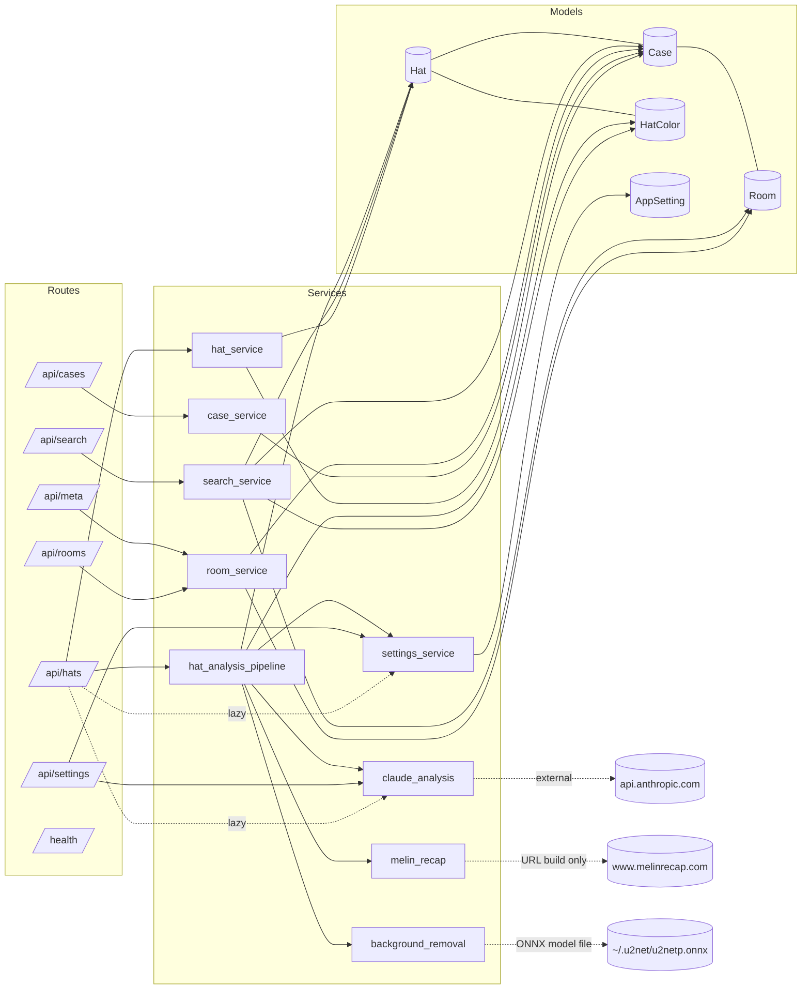
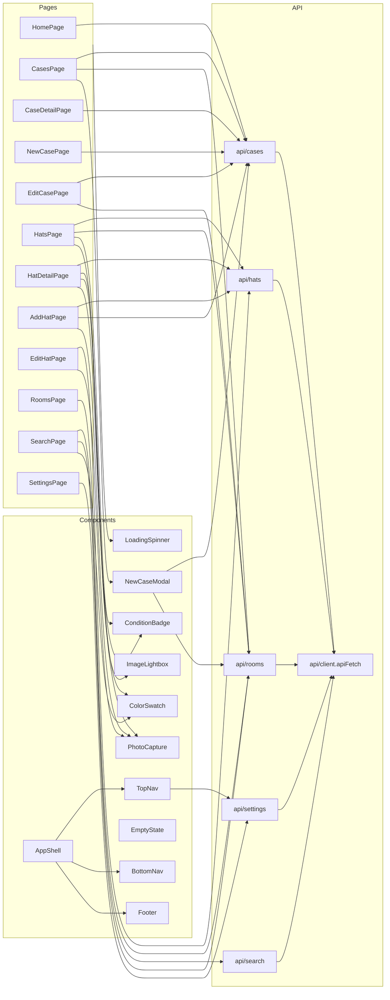

# Roentgen — Structural X-Ray

## 1. File / Module Inventory

### Backend (`src/headroom/`) — Python 3.12

```
src/headroom/                           total ~1,889 LOC
├── __init__.py                  0
├── app.py                      94    FastAPI factory, lifespan, SPA mount
├── config.py                   23    pydantic-settings (HEADROOM_ env prefix)
├── database.py                120    Async engine, Base, _run_migrations(), ensure_default_room()
├── models/                    137
│   ├── __init__.py              8    re-export (Case, Hat, HatColor, Room, AppSetting)
│   ├── app_setting.py          18
│   ├── case.py                 30
│   ├── hat.py                  65
│   ├── hat_color.py            21
│   └── room.py                 23
├── schemas/                   208
│   ├── __init__.py              0
│   ├── case.py                 48
│   ├── hat.py                 106    StrEnums (HatStyle, HatSize, HatCondition) + Read/Create/Update
│   ├── room.py                 19
│   ├── search.py               17
│   └── settings.py             18
├── routes/                    605    7 routers, 33 endpoints (see §5)
│   ├── __init__.py             18    api_router aggregator
│   ├── cases.py               128
│   ├── hats.py                213    largest route file
│   ├── health.py                8
│   ├── meta.py                 43
│   ├── rooms.py                49
│   ├── search.py               43
│   └── settings.py            126
├── services/                  775
│   ├── __init__.py              0
│   ├── background_removal.py   59    rembg wrapper (async via to_thread)
│   ├── case_service.py         91
│   ├── claude_analysis.py     262    AsyncAnthropic + tool-use schema
│   ├── hat_analysis_pipeline.py 116   bg-removal → claude → resale-pointer
│   ├── hat_service.py         179    capacity validation + CRUD
│   ├── melin_recap.py          60    URL builder (no fetch)
│   ├── room_service.py         72
│   ├── search_service.py       57
│   └── settings_service.py     56
└── utils/
    ├── __init__.py              0
    └── photo.py                42    Pillow + HEIF resize/convert
```

### Tests (`tests/`) — Python 3.12, pytest-anyio

```
tests/                                  total 959 LOC
├── __init__.py                  0
├── conftest.py                 82    in-memory SQLite, ASGITransport, rembg stub
├── test_capacity.py            99
├── test_cases.py              108
├── test_hats.py               141
├── test_melin_recap.py         40
├── test_photos.py             113
├── test_rooms.py               78
├── test_routes.py               8
├── test_search.py             227    largest test file
└── test_settings_api.py        63
```

### Frontend (`frontend/src/`) — React 19, TS, Vite

```
frontend/src/                           total ~4,890 LOC (incl. CSS)
├── main.tsx                    11
├── App.tsx                     49    BrowserRouter + 13 routes + QueryClient
├── vite-env.d.ts                1
├── api/                       204
│   ├── client.ts               17    apiFetch<T> wrapper
│   ├── cases.ts                37
│   ├── hats.ts                 68
│   ├── rooms.ts                33
│   ├── search.ts                9
│   └── settings.ts             40
├── types/
│   └── index.ts               109    mirrors backend Pydantic schemas
├── styles/
│   ├── tokens.css             154
│   └── app.css              1,278    *** RED FLAG: largest single file ***
├── components/
│   ├── layout/
│   │   ├── AppShell.tsx        17
│   │   ├── BottomNav.tsx       29
│   │   ├── BottomNav.css       79
│   │   ├── Footer.tsx           7
│   │   └── TopNav.tsx          33
│   ├── common/
│   │   ├── ColorSwatch.tsx     25
│   │   ├── ConditionBadge.tsx   4
│   │   ├── EmptyState.tsx      28
│   │   ├── ImageLightbox.tsx   49
│   │   ├── LoadingSpinner.tsx  12
│   │   └── NewCaseModal.tsx    72
│   └── photos/
│       └── PhotoCapture.tsx    63
└── pages/                   ~2,089 LOC
    ├── HomePage.tsx           181
    ├── CasesPage.tsx          117
    ├── CaseDetailPage.tsx     142
    ├── NewCasePage.tsx         61
    ├── EditCasePage.tsx       110
    ├── HatsPage.tsx           260
    ├── HatDetailPage.tsx      304    *** largest page ***
    ├── AddHatPage.tsx         160
    ├── EditHatPage.tsx        298
    ├── RoomsPage.tsx          165
    ├── SearchPage.tsx         220
    └── SettingsPage.tsx       211
```

### Top-level / infra

```
Dockerfile                       89   3-stage build (node → python-base → runtime)
docker-compose.yml               21
pyproject.toml                   38
uv.lock                       1,690
frontend/package.json            25
frontend/vite.config.ts          12   /api + /uploads proxy → :8000
frontend/tsconfig.json
frontend/index.html
seed/branding/logo.png                seeded into /data/uploads/branding on first boot
scripts/setup.sh                 32
README.md, CHANGELOG.md, CLAUDE.md, LICENSE (AGPLv3)
```

---

## 2. Dependency Tree

### 2a. Internal Python imports (`src/headroom/*`)

```
app.py
 ├── config.settings
 ├── database.init_db
 └── routes.api_router

routes/__init__.py            ← health, cases, hats, rooms, meta, search, settings
routes/cases.py               → config, database.get_db, schemas.case, services.case_service, utils.photo
routes/hats.py                → config, database.get_db, models.hat_color,
                                schemas.hat, services.hat_service,
                                services.hat_analysis_pipeline.finalize_hat_photo,
                                utils.photo
                                (and lazy intra-function imports of
                                 services.claude_analysis, services.hat_analysis_pipeline._apply_analysis,
                                 services.settings_service in reanalyze_hat)
routes/rooms.py               → database.get_db, schemas.room, services.room_service
routes/meta.py                → database.get_db, schemas.hat (HatCondition/Size/Style), services.room_service
routes/search.py              → database.get_db, schemas.hat (ColorTag), schemas.search,
                                services.search_service.search_hats
routes/settings.py            → config, database.get_db, schemas.settings,
                                services.settings_service, services.claude_analysis.verify_api_key,
                                utils.photo
routes/health.py              (no internal imports)

services/case_service.py      → models.case, schemas.case
services/hat_service.py       → models.case, models.hat, schemas.hat
services/room_service.py      → models.case, models.room, schemas.room
services/search_service.py    → models.case, models.hat, models.hat_color, models.room
services/settings_service.py  → config, models.app_setting
services/claude_analysis.py   → config (only — no internal models)
services/background_removal.py (only stdlib + Pillow + rembg)
services/melin_recap.py       (stdlib only)
services/hat_analysis_pipeline.py
                              → config, models.hat, models.hat_color,
                                services.settings_service,
                                services.background_removal.remove_background,
                                services.claude_analysis (ClaudeAnalysisError, HatAnalysis, analyze_hat_image),
                                services.melin_recap.build_resale_pointer

models/* (all)                → database.Base only

utils/photo.py                (Pillow + pillow_heif only)
```

No cycles. Strict layering: `routes → services → models → database`.

### 2b. Internal frontend imports (`frontend/src/*`)

```
main.tsx                      → App
App.tsx                       → react-router-dom, @tanstack/react-query,
                                components/layout/AppShell, all 13 pages

components/layout/AppShell    → TopNav, BottomNav, Footer, react-router-dom (Outlet)
components/layout/TopNav      → react-router-dom, @tanstack/react-query, api/settings.getLogo
components/layout/BottomNav   → react-router-dom (NavLink)
components/layout/Footer      (presentational only)

components/common/*           (mostly self-contained; some types from ../../types)
components/photos/PhotoCapture (self-contained)

pages/*  → mix of:
   api/{hats,cases,rooms,search,settings}
   components/common/{LoadingSpinner, ConditionBadge, ImageLightbox, ColorSwatch, NewCaseModal, EmptyState}
   components/photos/PhotoCapture
   types

api/*    → api/client.apiFetch + types
api/client.ts                 (self-contained)
```

Page-import frequency (most-used internal modules across pages):
- `components/common/LoadingSpinner` — 11 / 13 pages
- `@tanstack/react-query` hooks — 11 / 13 pages
- `components/photos/PhotoCapture` — 5 / 13 pages
- `api/cases.listCases` — 4 / 13 pages
- `api/rooms.{listRooms,getRoomOptions}` — 6 / 13 pages combined

### 2c. External Python deps (declared in `pyproject.toml`)

Runtime:
| Dep | Version pin | Notes |
|-----|-------------|-------|
| fastapi | unpinned | core HTTP framework |
| uvicorn[standard] | unpinned | ASGI server (Docker CMD) |
| sqlalchemy[asyncio] | unpinned (lock: 2.x) | ORM |
| aiosqlite | unpinned (lock: 0.22.1) | async SQLite driver |
| pydantic-settings | unpinned | config loader |
| python-multipart | unpinned | multipart form for uploads |
| Pillow | unpinned | image resize/convert |
| pillow-heif | unpinned | HEIC support |
| **anthropic** | **>=0.40.0** (lock: 0.97.0) | **NEW — Claude SDK (AsyncAnthropic)** |
| **httpx** | unpinned | listed at top level (also pulled by anthropic) |
| **beautifulsoup4** | unpinned | declared but NOT imported anywhere in `src/` |
| **rembg[cpu]** | **>=2.0.50** | **NEW — background removal (ONNX U²-Net)** |
| **onnxruntime** | unpinned | **NEW — required by rembg** |

Dev: `pytest`, `anyio[trio]`, `pytest-anyio`.

Transitive packages of note pulled by the new pipeline (from `uv.lock`):
`numpy`, `numba`, `llvmlite`, `scipy`, `scikit-image`, `tifffile`,
`imageio`, `pymatting`, `pooch`, `networkx`, `lazy-loader`,
`onnxruntime` (→ `flatbuffers`, `protobuf`), `jsonschema`,
`jiter`, `distro`, `docstring-parser` (latter four via `anthropic`).

`uv.lock` total: 75 packages locked (1,690 lines).

### 2d. External npm deps (`frontend/package.json`)

Runtime:
| Dep | Version |
|-----|---------|
| react | ^19.1.0 |
| react-dom | ^19.1.0 |
| react-router-dom | ^7.6.1 |
| @tanstack/react-query | ^5.80.7 |

Dev: `@types/react`, `@types/react-dom`, `@vitejs/plugin-react`, `typescript ~5.8.3`, `vite ^6.3.5`.

No Bootstrap package despite Bootstrap class names in JSX (CSS imported as plain stylesheet — `tokens.css` + `app.css`).

---

## 3. Symbol Graph

### 3a. Routes ↔ Services ↔ Models



#### Backend public surface (top-level exports)

| Module | Public symbols |
|---|---|
| `app` | `create_app()`, `app`, `lifespan`, `_seed_branding()` |
| `config` | `Settings`, `settings` |
| `database` | `Base`, `engine`, `async_session`, `get_db()`, `init_db()`, `ensure_default_room()` |
| `models.hat` | `Hat` (cols: id, case_id, position_in_case, photo_path, condition, size, style, is_beanie, brand, model_name, model_confidence, style_descriptor, design_notes, estimated_new_price[*_source], resale_price[*_source/url/checked_at], analysis_status/error/analyzed_at, timestamps); `display_id` property |
| `models.case` | `Case` (cols: id, case_type, sequence_number, display_id, photo_path, room_id, timestamps; rels: hats, room) |
| `models.room` | `Room` (cols: id, name, timestamps; rel: cases) |
| `models.hat_color` | `HatColor` (cols: id, hat_id, color_name, general_color, hex_value, dominance_rank, tier) |
| `models.app_setting` | `AppSetting` (key, value, updated_at) |
| `schemas.hat` | `HatCondition`, `HatSize`, `HatStyle` (StrEnums); `ColorTag`, `HatCreate`, `HatUpdate`, `HatRead`, `ColorsUpdate`, `HatAssign` |
| `schemas.case` | `CaseType`, `CaseCreate`, `CaseUpdate`, `HatSummary`, `CaseRead`, `CaseDetail` |
| `schemas.room` | `RoomCreate`, `RoomUpdate`, `RoomRead` |
| `schemas.search` | `SearchResult` |
| `schemas.settings` | `ApiKeyStatus`, `ApiKeyUpdate`, `ApiKeyTestResult` |
| `services.case_service` | `get_next_sequence`, `create_case`, `list_cases`, `get_case_by_display_id`, `update_case`, `delete_case` |
| `services.hat_service` | `MAX_REGULAR=4`, `MAX_BEANIE=6`, `create_hat`, `list_hats`, `get_hat`, `update_hat`, `delete_hat`, `assign_hat` |
| `services.room_service` | `list_rooms`, `get_room`, `create_room`, `update_room`, `delete_room` |
| `services.search_service` | `search_hats` |
| `services.settings_service` | `ANTHROPIC_KEY_NAME`, `mask_key`, `get_anthropic_key`, `set_anthropic_key`, `clear_anthropic_key` |
| `services.background_removal` | `remove_background` (async); `_get_session` (lazy) |
| `services.claude_analysis` | `SYSTEM_PROMPT`, `HAT_ANALYSIS_TOOL`, `AnalyzedColor`, `HatAnalysis`, `ClaudeAnalysisError`, `analyze_hat_image`, `verify_api_key` |
| `services.melin_recap` | `MELIN_BASE`, `is_melin`, `melin_recap_link`, `build_resale_pointer` |
| `services.hat_analysis_pipeline` | `finalize_hat_photo`, `_apply_analysis` |
| `utils.photo` | `MAX_DIMENSION=1200`, `generate_filename`, `process_image`, `validate_image_content_type` |

### 3b. Frontend pages ↔ components ↔ api



#### Frontend public surface

| Module | Exports |
|---|---|
| `App` | `App` |
| `api/client` | `apiFetch<T>` |
| `api/hats` | `listHats, getHat, createHat, updateHat, deleteHat, uploadHatPhoto, reanalyzeHat, updateHatColors, assignHat, getStyles, getSizes, getConditions` (12) |
| `api/cases` | `listCases, getCase, createCase, updateCase, deleteCase, uploadCasePhoto` (6) |
| `api/rooms` | `listRooms, getRoom, createRoom, updateRoom, deleteRoom, getRoomOptions` (6) |
| `api/search` | `searchHats` (1) |
| `api/settings` | `getLogo, uploadLogo, deleteLogo, getApiKeyStatus, setApiKey, deleteApiKey, testApiKey` (7) |
| `types` | `ColorTag, HatSummary, CaseRead, CaseDetail, HatRead, SearchResult, MetaOption, RoomRead, ApiKeyStatus, ApiKeyTestResult` (10) |
| `components/layout` | `AppShell, TopNav, BottomNav, Footer` |
| `components/common` | `ColorSwatch (+ ColorSwatches), ConditionBadge, EmptyState, ImageLightbox, LoadingSpinner, NewCaseModal` |
| `components/photos` | `PhotoCapture` |

---

## 4. Boundary Map

### Process

| Process | Where | Notes |
|---|---|---|
| `uvicorn headroom.app:app` | Dockerfile CMD, dev: `uv run uvicorn …` | single Python process; `tini` PID 1 in Docker |
| `vite dev` (dev only) | `frontend && npm run dev` (port 5173) | proxies `/api` and `/uploads` to :8000 |
| `node` (build only) | Dockerfile stage 1 | runs `tsc -b --noEmit && vite build` to produce `frontend/dist` |
| Background thread | `background_removal._remove_sync` via `asyncio.to_thread` | guarded by `asyncio.Lock` (`_session_lock`); single shared rembg session |

### Network ingress

| Surface | Source | Notes |
|---|---|---|
| TCP :8000 | `EXPOSE 8000`, docker-compose port mapping | only exposed port |
| `/health` GET | `routes/health.py` | unauthenticated |
| `/api/*` 33 endpoints (see §5) | `routes/__init__.py` aggregator | CORS allow-list from `settings.cors_origins` (default `http://localhost:5173`) |
| `/uploads/*` | mounted `StaticFiles(settings.upload_dir)` | only when dir exists at boot |
| `/assets/*` | mounted `StaticFiles(FRONTEND_DIST/assets)` | only when `frontend/dist` exists |
| `/{full_path:path}` | SPA fallback returning `index.html` | only registered when `frontend/dist` exists; catches all non-matched paths |

### Network egress

| Destination | Module | Method |
|---|---|---|
| `https://api.anthropic.com/v1/messages` | `services/claude_analysis.py` | `AsyncAnthropic(api_key, timeout=settings.http_timeout).messages.create(model=settings.anthropic_model, system=[…cache_control: ephemeral], tools=[HAT_ANALYSIS_TOOL], tool_choice=…)`. Used by `analyze_hat_image()` and `verify_api_key()`. |
| `https://www.melinrecap.com/?…` | `services/melin_recap.py` | URL string construction only — **no outbound HTTP performed**. Stored on the hat row as `resale_price_url`. |

`httpx` is declared but only used transitively by the `anthropic` SDK in current code paths. `beautifulsoup4` is declared but never imported.

### Filesystem

| Path | Read / write | Module |
|---|---|---|
| `settings.upload_dir` (default `uploads/`, Docker `/data/uploads`) | mkdir on lifespan, mkdir per route | `app.py`, `routes/{cases,hats,settings}` |
| `…/uploads/cases/<uuid>.jpg` | write (Pillow) / unlink old | `routes/cases.py:upload_case_photo`, `utils/photo.process_image` |
| `…/uploads/hats/<uuid>.jpg` then `<uuid>.png` | write JPEG → write PNG (rembg) → unlink JPEG | `routes/hats.py:upload_hat_photo`, `services/hat_analysis_pipeline.finalize_hat_photo`, `services/background_removal._remove_sync` |
| `…/uploads/branding/logo.{png,jpg,webp}` | upload, resize ≤96px high, save | `routes/settings.py:upload_logo` |
| `seed/branding/*` | read-only, copied on first boot if not present | `app.py:_seed_branding` |
| `tempfile.NamedTemporaryFile` | scratch upload buffer | every photo upload route |
| `<HOME>/.u2net/<model>.onnx` | read (rembg lazy load); pre-cached in Docker stage 2 | `services/background_removal._get_session` |
| `frontend/dist/` | read-only static serving | `app.py` |

### Database

| Engine | Driver | URL default |
|---|---|---|
| SQLAlchemy 2.x async | `aiosqlite` | `sqlite+aiosqlite:///./headroom.db`; in Docker: `sqlite+aiosqlite:////data/headroom.db`; in tests: `sqlite+aiosqlite://` (in-memory) |

Schema lifecycle in `database.py`:
1. `_run_migrations` — `inspect()` then `text()` ALTER/CREATE for: `rooms`, `app_settings`, `cases.room_id`, `hat_colors.{general_color,tier}`, `UPDATE hats SET size='classic' WHERE size='standard'`, and 14 ALTER TABLE columns on `hats` (driven by static `_HAT_COLUMN_DDL` dict).
2. `Base.metadata.create_all` — handles brand-new tables.
3. `ensure_default_room` — raw SQL `INSERT OR …` for `rooms(id=1)`.

Tables: `rooms`, `cases`, `hats`, `hat_colors`, `app_settings` (5).

---

## 5. Size / Shape Metrics

### LOC by top-level module

| Module / area | LOC | Files |
|---|---:|---:|
| `src/headroom/services/` | 775 | 9 (incl. `__init__`) |
| `src/headroom/routes/` | 605 | 8 |
| `src/headroom/schemas/` | 208 | 6 |
| `src/headroom/models/` | 137 | 6 |
| `src/headroom/database.py + app.py + config.py + utils/` | 279 | 5 |
| **Backend total (`src/headroom/`)** | **~1,889** | **~38** |
| `tests/` | 959 | 11 |
| `frontend/src/pages/` | 2,089 | 12 |
| `frontend/src/components/` | 418 | 12 (incl. CSS sidecars) |
| `frontend/src/api/` | 204 | 6 |
| `frontend/src/styles/` | 1,432 | 2 |
| `frontend/src/types/` + `App.tsx` + `main.tsx` + env.d | 170 | 4 |
| **Frontend total (`frontend/src/`)** | **~4,313** | **36** |

### Public surface area

| Surface | Count |
|---|---:|
| HTTP endpoints (excluding `/health` and SPA catch-all) | **32** (`/health` makes 33 total) |
| Routers registered in `api_router` | 7 |
| Pydantic request/response schemas | 21 (incl. enums) |
| SQLAlchemy models | 5 |
| Service modules | 9 |
| Frontend page components | 13 |
| Frontend shared components | 11 |
| Frontend API functions | 32 |
| TypeScript public interfaces | 10 |

#### HTTP endpoint roster (33)

```
GET    /health
POST   /api/cases                              201
GET    /api/cases
GET    /api/cases/{display_id}
PUT    /api/cases/{display_id}
DELETE /api/cases/{display_id}                 204
POST   /api/cases/{display_id}/photo
POST   /api/hats                               201
GET    /api/hats
GET    /api/hats/{hat_id}
PUT    /api/hats/{hat_id}
DELETE /api/hats/{hat_id}                      204
PATCH  /api/hats/{hat_id}/assign
PUT    /api/hats/{hat_id}/colors
POST   /api/hats/{hat_id}/photo
POST   /api/hats/{hat_id}/reanalyze
POST   /api/rooms                              201
GET    /api/rooms
GET    /api/rooms/{room_id}
PUT    /api/rooms/{room_id}
DELETE /api/rooms/{room_id}                    204
GET    /api/meta/styles
GET    /api/meta/sizes
GET    /api/meta/conditions
GET    /api/meta/rooms
GET    /api/search
GET    /api/settings/logo
POST   /api/settings/logo
DELETE /api/settings/logo                      204
GET    /api/settings/api-key
PUT    /api/settings/api-key
DELETE /api/settings/api-key                   204
POST   /api/settings/api-key/test
```

### Oversized files (flagged by raw LOC)

| File | LOC | Note |
|---|---:|---|
| `frontend/src/styles/app.css` | **1,278** | 33% of all frontend LOC; no other CSS file exceeds 154 LOC |
| `frontend/src/pages/HatDetailPage.tsx` | 304 | largest page |
| `frontend/src/pages/EditHatPage.tsx` | 298 | |
| `src/headroom/services/claude_analysis.py` | 262 | largest service; embeds prompt + tool schema as Python literals |
| `frontend/src/pages/HatsPage.tsx` | 260 | |
| `tests/test_search.py` | 227 | largest test file |
| `frontend/src/pages/SearchPage.tsx` | 220 | |
| `src/headroom/routes/hats.py` | 213 | largest route file; carries lazy intra-function imports |
| `frontend/src/pages/SettingsPage.tsx` | 211 | |

### Boot side-effects ordered (`lifespan`)

```
1. settings.upload_dir.mkdir          # FS
2. (upload_dir/cases).mkdir           # FS
3. (upload_dir/hats).mkdir            # FS
4. (upload_dir/branding).mkdir        # FS
5. _seed_branding(branding_dir)       # FS read seed/, copy
6. init_db()                          # DB connect + _run_migrations + create_all + ensure_default_room
```

After lifespan, conditional mounts:
- `StaticFiles(/uploads)` if upload_dir exists
- `StaticFiles(/assets)` if frontend/dist exists
- catch-all `/{full_path:path}` SPA route only if frontend/dist exists

---

End of structural x-ray.
